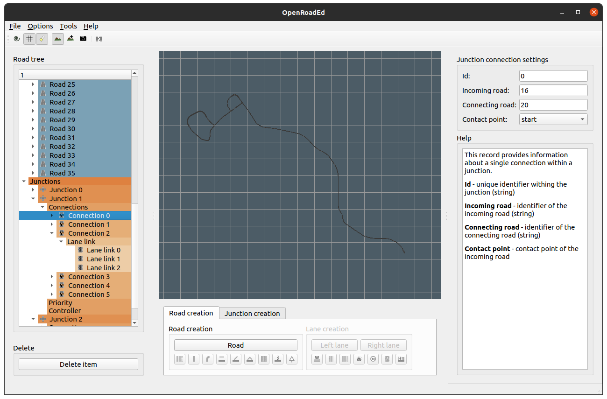

# OpenRoadEd on Linux

OpenRoadEd is simple application designed to create both logical (OpenDRIVE standard) and geometrical (OpenSceneGraph) descriptions of road networks created by Dmitri and Egor Kurteanu. 

This fork was adapted to compile on modern Linux operating systems by Hermann Höhne and Hamid Ebadi.



## Build Instructions 

### Ubuntu 24.04

#### Install dependencies

```
sudo apt install git cmake g++ libopenscenegraph-dev qtbase5-dev
```

#### Fetch osgQt

```
git submodule --init update
```

On some systems this can be skipped, as osgQt is part of openscenegraph (e.g. Ubuntu 18.04).

#### Build OpenRoadEd

```
git clone --recurse-submodules https://github.com/fhwedel-hoe/OpenRoadEd.git
cd OpenRoadEd
mkdir OpenRoadEd/build
cmake -S OpenRoadEd -B OpenRoadEd/build
cmake --build OpenRoadEd/build --parallel 8
```

### Windows 11

#### Install dependencies

Download and build dependencies (this may take hours).

    …\vcpkg\vcpkg.exe install osg:x64-windows osgQt:x64-windows qt6:x64-windows

Static builds will not work.

#### Build OpenRoadEd

```
cd OpenRoadEd
…\VisualStudio\2019\Community\VC\Auxiliary\Build\vcvars64.bat
cmake -S OpenRoadEd -B OpenRoadEd/build -GNinja -DVCPKG_TARGET_TRIPLET=x64-windows -DCMAKE_TOOLCHAIN_FILE=…\vcpkg\scripts\buildsystems\vcpkg.cmake
cmake --build OpenRoadEd/build --parallel 8
```

## Run OpenRoadEd

Execute OpenRoadEd binary from the same directory as "Resources" dicrectory by running the following commands:

```
cd ~/OpenRoadEd/
LC_ALL=C ./OpenRoadEd/build/OpenRoadEd
```

Forcing the locale is a necessary workaround for issue #8.

Please read the [OpenDrive Road Editor Usage Guide](Help/OpenRoadEdHelp.pdf) document for software usage instructions.


## Origin

OpenRoadEd was created as part of this [master's thesis by Dmitri and Egor Kurteanu](http://hdl.handle.net/2077/23047) that is accessible from [sourceforge](https://sourceforge.net/projects/openroaded/) and [gitlab](https://gitlab.com/OpenRoadEd/OpenRoadEd).
