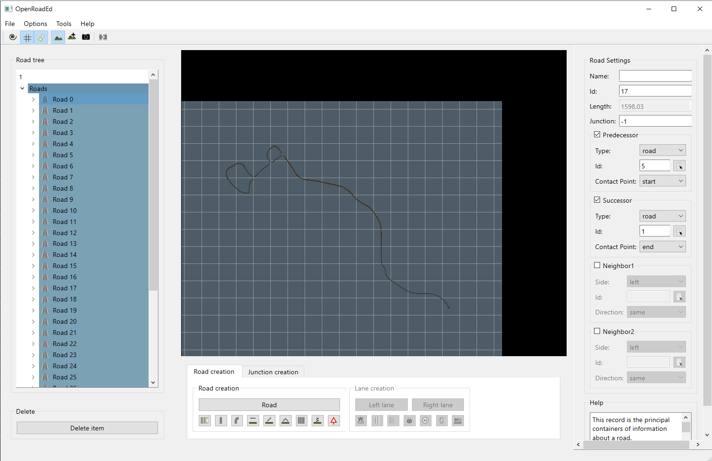

# OpenRoadEd on Linux

OpenRoadEd is simple application designed to create both logical (OpenDRIVE standard) and geometrical (OpenSceneGraph) descriptions of road networks created by Dmitri and Egor Kurteanu. 

This fork was adapted to compile on modern Linux operating systems by Hermann Höhne and Hamid Ebadi.


## Build Instructions 

### Ubuntu 24.04

#### Install dependencies

```
sudo apt install git cmake g++ libopenscenegraph-dev qt6-base-dev libxkbcommon-dev
```

#### Build OpenRoadEd

```
git clone --recurse-submodules https://github.com/fhwedel-hoe/OpenRoadEd.git
cd OpenRoadEd
mkdir OpenRoadEd/build
cmake -S OpenRoadEd -B OpenRoadEd/build
cmake --build OpenRoadEd/build --parallel 8
```

### Windows 11

#### Install dependencies

Download and build dependencies (this may take hours):

    …\vcpkg\vcpkg.exe install osg:x64-windows qt:x64-windows

If you do not want to wait for the Qt compilation, you can also download and install pre-built binaries from https://www.qt.io/download-qt-installer-oss.

#### Build OpenRoadEd

Use the "x64 Native Tools Command Prompt for VS 2022". Alternatively, you can source `…\VisualStudio\2019\Community\VC\Auxiliary\Build\vcvars64.bat` in an existing `cmd` prompt.

```
git clone --recurse-submodules https://github.com/fhwedel-hoe/OpenRoadEd.git
cd OpenRoadEd
cmake -G Ninja -S OpenRoadEd -B OpenRoadEd/build -DVCPKG_TARGET_TRIPLET=x64-windows -DCMAKE_TOOLCHAIN_FILE=…\vcpkg\scripts\buildsystems\vcpkg.cmake
cmake --build OpenRoadEd/build --parallel 8
```

If you use the pre-built Qt, you need to add it to the CMake Prefix path: `-DCMAKE_PREFIX_PATH="…\Qt\6.8.2\msvc2022_64\lib\cmake"`

## Run OpenRoadEd

### Linux

Execute OpenRoadEd binary from the same directory as "Resources" dicrectory by running the following commands:

```
cd ~/OpenRoadEd/
LC_ALL=C ./OpenRoadEd/build/OpenRoadEd
```

Forcing the locale is a necessary workaround for issue #8.

### Windows

Depending on how you installed Qt, you need to add it to the PATH: `…\Qt\6.8.2\msvc2022_64\bin`

OpenSceneGraph needs plug-ins for loading textures. You may need to set `OSG_LIBRARY_PATH` to the appropriate path depending on the build type:

* `…\vcpkg\installed\x64-windows\plugins`
* `…\vcpkg\installed\x64-windows\debug\plugins`

Alternatively, you can copy the `osgPlugins-3.6.5` directory into the build directory.

Then you can execute `.\OpenRoadEd\build_msvc\OpenRoadEd.exe`.



### Usage

Please read the [OpenDrive Road Editor Usage Guide](Help/OpenRoadEdHelp.pdf) document for software usage instructions.

## Origin

OpenRoadEd was created as part of this [master's thesis by Dmitri and Egor Kurteanu](http://hdl.handle.net/2077/23047) that is accessible from [sourceforge](https://sourceforge.net/projects/openroaded/) and [gitlab](https://gitlab.com/OpenRoadEd/OpenRoadEd).
